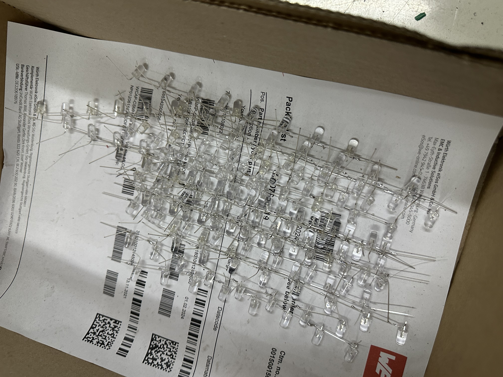
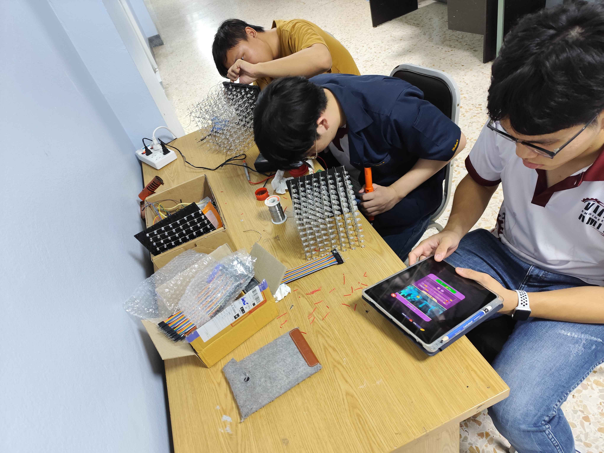
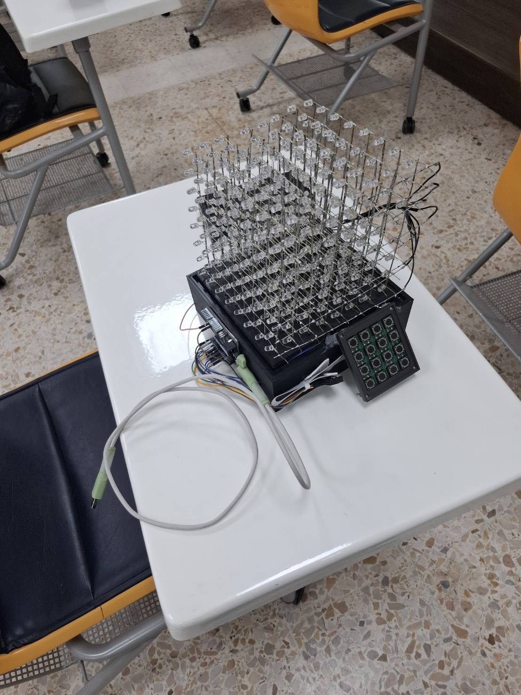

# 8x8x8 LED Cube Project

## Overview 
Repo นี้เป็นโปรเจกวิชา Circuit & Electronic ของผมตอนเรียนอยู่ KMITL โดยโปรเจคนี้เป็นหัวข้อที่ Assign มาจากอาจารย์อีกที โจทย์คือทำ Led Cube ขนาดใดก็ได้โดยจะนำโปรเจคนี้ไปให้เด็กพิการได้ใช้เป็นสื่อในการเรียนรู้ ตัวของโปรเจคเริ่มจากการเลือกใช้ โปรแกรมออกแบบและตัวหน้าที่ต่างๆ เราจะออกแบบ Model ของกล่องที่ใช้เป็นฐานเก็บวงจรและเป็น Base ให้กับตัว Led Cube ด้วย Solid Work 2023 แล้วนำตัวโมเดล Cad ไปปริ้นด้วย 3D Printer อีกที ตัววงจรจะออกแบบด้วย EasyEDA โดยใช้บอร์ด Control เป็น Arduino UNO R4 WIFI แล้วสื่อสารกับตัว Shift Register แบบ Serial in Parallel Out (SIPO) ด้วย Protocol SPI แล้วใช้ Transistor BD241C เป็น Low Side Switch ในการเปิดปิดและรับโหลดของหลอดไฟทั้ง Layer เนื่องจากกระแสในวงจรนั้นสูงมาก จากหลอดไฟ 20mA ทั้งเลเยอร์หรือก็คือ 64 หลอด 64 X 0.02 mA = 1.28A ซึ้งเสเปกโดยทั้วไปอาจจะใช้ขับหลอดไฟภายในเลเยอร์ไม่ได้ในส่วนของโปรแกรมจะสั่ง Input จาก 4X4 KeyPad แล้วใช้เป็น Logic Decision ในการเล่น Animation โดยตัวโค้ดในการออกแบบ Animation จะใช้จินตนาการว่า Led Cube คือการ Integrate พื้นที่ในแคลคูลัสแบบ Discrete 8X8X8 หรือแยก Position เป็น จุดออกมาจากการอินทีเกรตแล้วเขียนกราฟที่มี Animation ลงไปในสมการให้ตัว โหนดแต่ละโหนดเล่นตามสมการจึงเป็นสาเหตุว่าใน Code เป็นสมการแทบจะทั้งหมด

## Tech Stack 
- $\color{cyan}{\textbf{Hardware :}}$ Arduino UNO R4 WIFI, 74HC595 
- $\color{orange}{\textbf{Firmware :}}$ C++ (Arduino Framework) 
- $\color{purple}{\textbf{Design :}}$ Solid Work 2023, EasyEDA 

## Concept 
เราใช้การควบคุมแบบ $8 \times 8 \times 8$ โดยแบ่งเป็น:
- $\color{green}{\textbf{Columns : }}$ 64 จุด ควบคุมผ่าน 8x Shift Registers
- $\color{green}{\textbf{Layers : }}$ 8 ชั้น ควบคุมผ่าน Transistor Darlington Array

## Build Process 
| Building the Jig | Soldering Layers | Final Assembly |
| :---: | :---: | :---: |
|  |  |  |

## Contributors 
- $\color{red}{\textbf{Panya Triprom}}$ ([@KENASTES](https://github.com/KENASTES))
- $\color{red}{\textbf{Rathiphat Buakaew}}$ ([@ratiphat2548](https://github.com/ratiphat2548))
- $\color{red}{\textbf{Ploynumthong Chaiyotha}}$ ([@Ploynumthong](https://github.com/Ploynumthong))

---
*Created for Educational Purpose @KMITL*